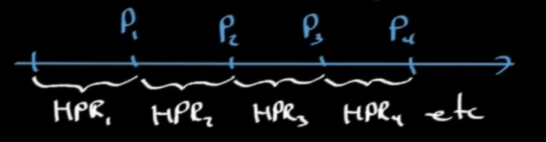
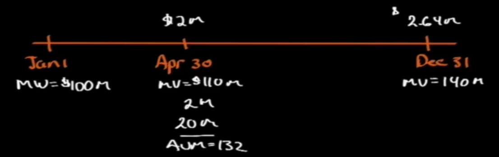

# Discounted Cash Flow Application

## Net Present Value (NPV) 

A company has an inflow and outflow of cash. We want to get the Net Present Value of what they have currently. Discount rate $r$ is usually refred to as opportunity cost of capital, typically the Weighted Average Cost of Capital (WACC, will see more in Corporate Finance).

> Investment Rule: when considering which project to do, if NPV > 0 => Accept, else Reject

> How to calculate NPV? 2 step process:
>
> 1. Calculate $PV(inflows)$
> 1. Calculate $PV(outflows)$
>
> Then $NPV = PV(inflows) - PV(outflows)$

Ex: Let's say we have a project that have an inflow of $.5$, $.75$, $1.35$ at $t=1,2,3$ respectively, with a WACC of $10\%$. We have a one-time outflow of $-2$. We want to see if this is worth it:

$$NPV = PV(inflows) - PV(outflows) = 2,088,655 - 2,000,000 > 0$$

Looks like this will be a profitable one, so acccept.

Ex: We can make an investment at $t=0$ of $\$1M$, which provides a perpetuity of $150k$ every payment, with a WACC = $10\%$. We have that

$$PV(inflows) = \frac{A}{r} = \frac{150k}{0.1} = \$1.5M$$
$$PV(outflows) = \$1M$$
$$NPV = PV(inflows) - PV(outflows) = 1.5M - 1M = \$0.5M > 0$$

So we accept this investment.

Ex: What if WACC = $15\%$?

$$PV(inflows) = 1M$$

Then $NPV=0$, covers cost of capital but create $0 shareholder wealth. So nah, not so profitable. Usually if the closer $NPV$ is to 0, then think twice

## Internal Rate of Return (IRR)

> Def: The discount rate that results in $NPV = 0$

This is usually used in Fixed-Income to get the Yield-to-Maturity (only valid if coupons can be reinvested at the YTM rate).

IRR assumes that cash flow, when realized, can be reinvested at the project same IRR, but this is not always realistic.

So for IRR, we have

$$0 = \frac{CF_0}{1+IRR}^0 + \frac{CF_1}{1+IRR}^1 + \cdots + + \frac{CF_N}{1+IRR}^N$$

Usually, the first cashflow is the investment $CF_0$. So, to fin IRR, we can usually just solve from:

$$Investment = PV (CF)$$

### Maintenance investment

Let's say for our project/investment, we have maintenance paid every some period of time.

This will usually mean there will be more than 1 IRR. In this case, IRR won't work, **go with NPV** instead.

> Investment Rule: If IRR > WACC, Accept, else Reject

### Examples
Ex: Let's say we invest $\$1M$ for a perpetuity of $\$150k$, with a WACC of $10\%$. What's the IRR?

To find IRR, let

$$Inv = PV(inflows) = A$$

$$ 1M = \frac{150k}{IRR}$$

$$IRR = 150k/1M = 15\%$$

this is more than the WACC, so not worth it. REJECT

Ex: Investment $\$1,000$ at $t=0$, pays $\$294.8$ from $t=1$ to $t=5$. What if WACC is $11\%$, is this investment worth it?

Find NPV:

$$PV_i = 294.8\left[\frac{1-(1.11)^5}{.11}\right] = 1089.55$$

$$PV_o = 1000$$

Then

$$NPV = 1089.55 - 1000 = 89.55 > 0$$

Accept!

What about the IRR? Let

$$Inv = A\left[\frac{1-(1+IRR)^{-5}}{IRR}\right]$$

$$1000 = 294.8\left[\frac{1-(1+IRR)^{-5}}{IRR}\right]$$

Then
$$IRR = 14.5\% < 15\% = WACC$$

Accept!

## Caveats

> These two rules using NPV and IRR to decide an investment is worth it are NOT interchangeable. Good rule of thumb: When IRR & NPV differs, choose the NPV side!

Continue at 18:45

## Portfolio Return

Let's say we buy an asset at price $P_0$, and sell at price $P_1$, then Holding Period Return $HPR = \frac{P_1-P_0}{P_0}$.

Let's say while we're holding that asset, we receive CF of D_1, then $HPR = \frac{P_1 - P_0 + D_1}{P_0}$.

Question: How to calculate HPR if:

- payment spans several periods: Called money-weighted rate of return
- P_0 includes multiple additions/withdrawals: Called time-weighted rate of return

Solution: Use IRR, accounts for timing/amounts of in/outflows

### Money-weighted rate of return

More emphasis on year with more funds invested. BUT: investors decide that, not management.

### Time-weighted rate of return

> Def: measures the compounded rate of growth of $1 over the measurement period

We then have

$$(1+twrr)^n = (1+HPR_1)(1+HPR_2)\cdots(1+HPR_n)$$

Ex: Year 1, we make 15%, year 2, we make 6.67%.

We have:

$$(1+twrr)^2 = (1+HPR_1)(1+HPR_2)$$
$$(1+twrr)^2 = (1.15)(1.0667)$$
$$ twrr = \sqrt{(1.15)(1.0667)} - 1 = 10.76\%$$

This is more preferred than MWRR.

Continue at 30:50

Ex: Suppose we have four quarters:

Quarter | $Q_1$ | $Q_2$ | $Q_3$ | $Q_4$
--- | --- | --- | --- | ---
Beginning Value (millions) | 4 | 6 | 5.775 | 6.72
+/- | 1 | 0.5 | 1 | .225 | (.6)
Total Investment | 5 | 5.5 | 6 | 6.12
Ending Value | 6 | 5.775 | 6.72 | 5.508
HPR | .2 | .05 | .12 | -.1

Then we have TWRR (the power of the $(1+twrr)$ has to be in YEARS, not HOLDING PERIODS!!!):
$$(1+twrr)^1 = (1.2)(1.05)(1.12)(.9)$$
$$twrr = (1.2)(1.05)(1.12)(.9) - 1 \approx 27\%$$

### Comparing MWRR and TWRR side-by-side

>**Question**: If a company pays an $X dividends, does not the price of the stock drops by the amount of the dividends?
>
>**Answer**: Stock drops not on the day of dividend, but on the EX-dividend date (first day a stock trades without its most recently declared dividend), which might have already long gone before the divident payout date.
Jan 1, Firm A has market value $100M.

From Jan 1 and Apr 30, shows a gain of $10M.

Apr30 we have market value $110M. Also pays a dividend of $2M, and all dividends are reinvested in the company. Also, institutions invest another 20M.

Total AUM on Apr30: 132M

Dec 31: stock pays dividends of 2.64M. Market value currently (not including the dividends) is 140M.

$HPR_1$ (Jan1 - Apr30): $\frac{110-100+2}{100} = 12\%$

$HPR_2$ (Apr30 - Dec31): $\frac{140-132+2.64}{132} = 8.06\%$

We have, for TWRR

$$twrr = (1.12)(1.0806) - 1 = 21.03\%$$

We have, for MWRR

We have:

$$CF_0 = 100$$
$$CF_1 = -20$$
$$CF_2 = 0$$
$$CF_3 = 142.64$$

$$IRR_{period} = 6.28\%/\text{per period}$$

$$(1.0628)^3 - 1 = .200479 = \approx 20\%$$

## Money Market Yields

> Anything later referred to as MM Yield has:
>
> - Life of less than 1 year
> - Sold at discount basis
> - Mature at par
> - 360-day count convention
>

### T-Bills

Quoted on a Bank Discount Basis

> Bank Discount Basis: $$r = \frac{Discount}{Face Value} \times \frac{360}{Time}$$

Ex: 150-day T-Bill at 98.

We have $Discount = 98 - 100 = 2$. Then

$$r = \frac{2}{100} \times \frac{360}{150} = 4.8\%$$

Rearranging the Bank Discount Basis:

$$D = F \cdot \frac{t}{360}\cdot r

Note:

- Yield is based on par (the money you will receive at maturity), not on price (the money you invest)
- 360-day count convention, not 365
- annualized with simple, not compound interest

