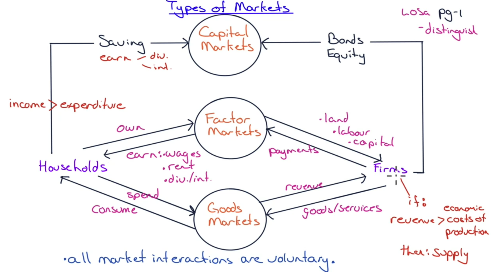
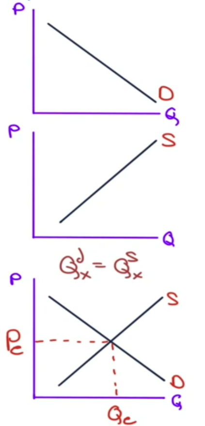
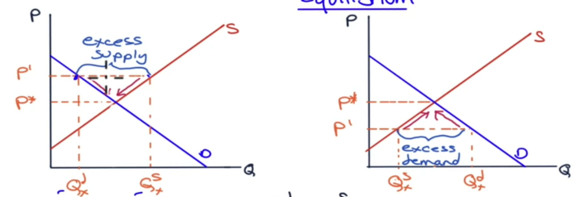
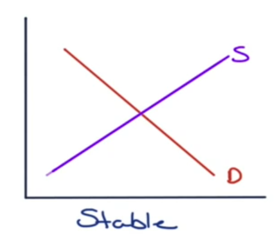
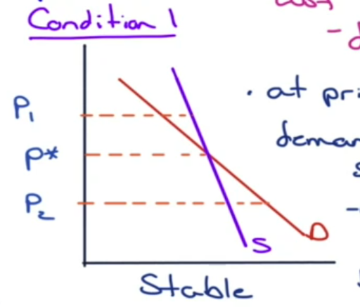
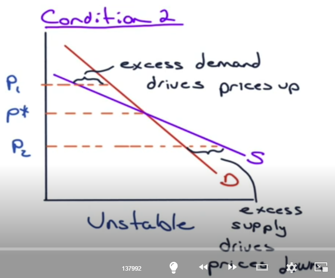
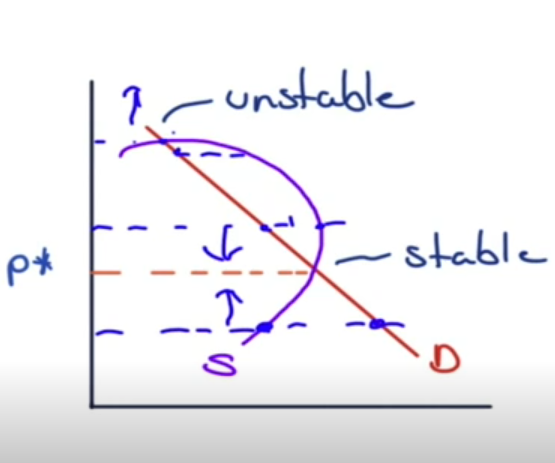

# Demand and Supply

## Types of Markets

For Firms, if revenue > economic costs of production, then supply has.

Households are the ultimate owner of all equity and all debts of all firms.

Must be noted that all market interactions are voluntary

## Principles of Demand & Supply

### Demand

> Demand
>
> Definition: The willingness and ability of consumers to purchase a given amount of a good/service at a given price

We have:
> Demand function
>
> Definition: $Q^d_x = f(P_x, I, P_y...)$
> - $P_x$: price
> - $I$: your level of income
> - $P_y$: price of other products that can be substitue or complement

Demand is driven by something called **Law of Demand**.

> Law of Demand
>
> Definition: As $P_x$ goes up, $Q^d_x$ goes down, and vice versa. Layman terms, the higher the price increases, the lower the demand.

We have that: $$Q^d_x = Int - P_x + I - P_y$$

Here, $Int$ is intercept constant term.

$P_y$ if is:
- negative coefficients => complement product
- positive coefficients => substitute product

$I, P_y$ is usually exogenous variables, so typically hold these constant

Thus: $$Q^d_x = Int - coef P_x$$

$$coef P_x = Int - Q^d_x$$

$$P_x = Int/coef - Q^d_x / coef$$

This is called the **inverse demand function**. The price is solved for a given quantity

### Supply

> Supply
>
> Definition: The willingness and ability of sellers to offer a given quantity of a good/service at a given price.

We have:

> Supply function
>
> Definition: $Q^s_x = f(P_x, W...)$

Supply is driven by **Law of Supply**.

> Law of Supply
>
> Definition: As $P_x$ goes up, $Q^s_x$ goes up, and vice versa

We have that: $$Q^s_x = Int + P_x - W$$

(higher production cost will make $Q^s_x$ goes down, that means less people are willing to supply it)

$W$ is exogenous variable, so typically held constant.

Thus:

$$Q^s_x = Int + coef P_x$$

$$ -coefP_x = Int - Q^s_x$$
$$ coefP_x = -Int +Q^s_x$$
$$P_x = -Int/coef + Q^s_x/coef$$

Then:
$$P_x = -Int + coef Q^s_x$$

This is called the inverse supply function.

### Point of Equilibrium

Top chart is Demand curve, mid chart is Supply curve

The cross between demand and supply is called the equilibrium.

## Shifts vs Movements

Causes of shifts in and movements along the demand and supply curve.

### Price drops

As the price drops, demand should increase. We move down the demand curve => **Change in quantity demanded**

As the price increases, supply should increase. We move up the supply curve => **Change in quantity supplied**

### Change in any other variables

Shifts the in the curve result from a exchange in other exogeneous variables

#### Income increases

Demand will increase when our income increase, even without changes in price. When we have more disposable incomes, we wants more stuff => **Change in demand**

#### Wages increase

Supply will decrease when wages increase, even without changes in price. Naturally because it's more expensive producing the same shit. => **Change in supply**

Ex: Demand function / Demand curve

$$Q^d_x = 2 - .4P_x + .0005I + .15 P_y$$

where $P_x = 10.68$, $I=2300$, $P_y=21.40$

1. Find $Q^d_x$

$$Q^d_x = 2 - .4*(10.68) + .0005(2300) + .15(21.40) = 2.088$$

2. Find the inverse demand function

$$Q^d_x = 2 - .4P_x + .005(2300) + .15(21.40)$$

$$Q^d_x = 6.36 - .4P_x$$

$$P_x = 15.90 - 2.5 Q^d_x$$

3. What is the slope of the demand curve? -2.5

4. What is the intercept of demand curve if $I$ increases to $3000$?

$$Q^d_x = 2 - .4P_x + .0005(3000) + .15(21.40)$$

$$Q^d_x = 6.71 - .4P_x$$

$$P_x = 16.68 - 2.5Q^d_x$$

Same slope, but intercept increases.

Ex: Supply function / supply curve

$$Q^s_x = -64.5 + 37.5P_x - 7.5W$$

where $P_x = 10.68, W = 10$.

1. Find $Q^s_x$

$Q^s_x = -64.5 + 37.5 (10.68) - 7.5(10) = 261$$

2. Find the inverse supply function

$$Q^s_x = -64.5 + 375P_x - 7.5(10)$$

$$Q^s_x = -139.5 + 37.5P_x$$

$$P_x = 3.72 + .0267 Q^s_x$$

3. What is the slope of the supply curve? $0.267$

4. Find Int if $w=15$

$$Q^s_x = -64.5 + 37.5 P_x - 7.5(15)$$

$$Q^s_x = -177 + 37.5P_x$$

Then intercept is $-177$.

## Aggregation

### Aggregating demand curve

To get a demand curve for a bigger scale, just add up all the demand curve of all sub products.

Demand curve: $Q^d_x = Int - coef\cdot P_x$

- add all the buyers together
- assume $n$ buyers

$Q^d_x = 6.36 - .4P_x$ with $n = 1000$ buyers. Then

$$Q^d_x = 1000(6.36 - .4P_x) = 6360 - 400P_x$$

$$P_x = 15.90 - .0025 Q^d_x$$

### Aggregating supply curve

Supply curve: $Q^s_x = Int + coef P_x$

- add all sellers together
- assume $n$ sellers

$Q^s_x = -139.5 + 37.5P_x$ with $n=8$

$$Q^s_x = 8(-139.5+37.5P_x) = -1116 + 300P_x$$

$$P_x = 3.72 + .0033Q^s_x$$

## Equilibrium

### Equlibrium analysis

- Prices will adjust until there is no excess supply or demand (market mechanism)
- If you leave market to their own devices, suppliers will reprice signals in the market
  - If inventory is building up at a certain price, will decrease price until inventory is going out
  - If inventory is slowing down at a certain price, will have more supply and increase price until inventory is not slowing down as much

Market equilibrium: $$Q^d_x = Q^s_x$$

$$6360 - 400P_x = -1116 + 300P_x$$
$$7476 = 700P_x$$
$$P_x = 7476/700 = 10.68$$

$$Q^d_x = 6360 - 400 (10.68) = 2088$$

This means that, if Product X is priced at 10.68, there will be demand for $2088$ of X and supply for $2088$ of X.

Though, this is just a **partial equilibrium analysis** (we haven't factored all elements yet i.e. incomes, wages...)

> Partial equilibrium analysis
>
> Definition: Find equilibrium in one market while taking the values of the exogenous variables as given

To have a more general look, we find the **general equilibrium analysis**.

> General equilibrium analysis
>
> Definition: Find equilibrium in all markets

### Stable vs Unstable Equilibria

### Stable Equilibrium

Condition for stability: As long as $m > 0$ supply curve and $m < 0$ demand curve. As long as this happens, even when we have excess demand (price below equilibrium) or excess supply (price above equilibrium), we will always have stable equilibrium.

Excess demand drives prices up, excess supply drives prices down.

- at prices > $p*$, hit demand before supply
- at prices < $p*$, hit supply before demand

### Unstable Equilibrium

With this curve we have:

- Excess demand drives prices up
- Excess supply drives prices down

This creates an unstable demand-supply, which causes a **bubble**.

>Bubbles
>
> Definition:
>
> - Buyers: keep buying, **not on value**, but on a rationalization that if they don't buy today, prices **will be higher** tomorow.
> - Sellers: hold back inventory to get higher prices tomorrow, which leads to another increase in price.

When this happens, sellers hold back, which leads to less supply, which increases price. This reinforces the beliefs that prices will go higher, which leads to more demand. Rinse and repeat, we have an expanding bubble.

This increase in price is not because of demand, but because of **lack of supply**.

Once the price goes down, sellers will shove their supplies out all at once, and this is when the normal rule of demand supply go into full force, and this will drive prices down HARD => The bubble bursts, and it bursts FAST.

Ex:

$$Q^d_x = 6360 - 400P_x$$
$$Q^s_x = -1116 + 300P_x$$

1. $P_x = 12$. What is the excess supply/demand? We have:

$$Q^d_x = 6360 - 400 (12) = 1560$$
$$Q^s_x = -1116 + 300(12) = 2484$$

$Q^d_x < Q^s_x$, so we have excess supply of $924$. Price has to come down.

2. $P_x = 8$

$$Q^d_x = 3160$$
$$Q^s_x = 1284$$

$Q^d_x > Q^s_x$, so we have excess demand of $1876$. Price will go up.

## Auctions

### Types of auctions

> Common value auction
>
> Definition: There's some actual value to what you're bidding on. Imagine there's a jar full of quarters and you bid on it, you won't know the value until you got it and count it up. e.g. oil/timber leases, Spectrum

> Private value auction
>
> Defintion: Value is subjective based on the thing bidding e.g. artworks

### Mechanisms

> Ascending Price Auction
>
> Defintion: Bids are given one people at a time where people keep bidding until no more bids, and the highest bidder wins

> Sealed Bid Auction
>
> Definition:
>
> 1. **First priced sealed bid auction**: Your bids are not public until the end of the auction. You put your bid in an envelope, hand in that envelope, and once everyone has submitted their bids, only then the envelopes are opened. **Highest bidder pays their bid**. This may actually result in a lower price, compared to the second price sealed bid auction
>  2. **Second price sealed bid auction** (Vickery auction): We know that the highest price tends to overprice, so everyone will write a lower price. A way to get a higher price, is to get the **highest bidder pay the second highest price**.

> Descending Price Auction (Dutch Auction)
>
> Definition: Price starts high and declines until the item is sold or the lot is cleared. If there are multiple items, highest bidder selects a quantity $Q$ they want, then bid drops until all $Q$ is gone. **First person to speak up, they pay the price**. Two types:
> - Single item
> - Multiple items: this is how Govt of Canada auction their bond

> Modified Dutch Auction (Single-price Dutch Auction)
>
> Definition: All bidders pay lowest bid that clears $Q$. This is how US Treasuries auction their bond. Why a little better? The highest bidder will start bidding will get, then people will start bidding down. They will get more value like this.

Competitive vs non-competitive bidders.

- Competitive bidders: specify prices/yields to win contracts or securities, driving market rates through direct price competition
- Non-competitive bidders: agree to accept the final market-determined price, simplifying participation for smaller investors but relying on the competitive process for pricing

The Dutch Auctions may include both competitive & non-competitive bids. Non-competitive bidders agree to pay the single price arrived at in the Dutch auction process.

Ex: $90B in T-Bills available, competitive + non-competitive bids

Continue at 57:30
