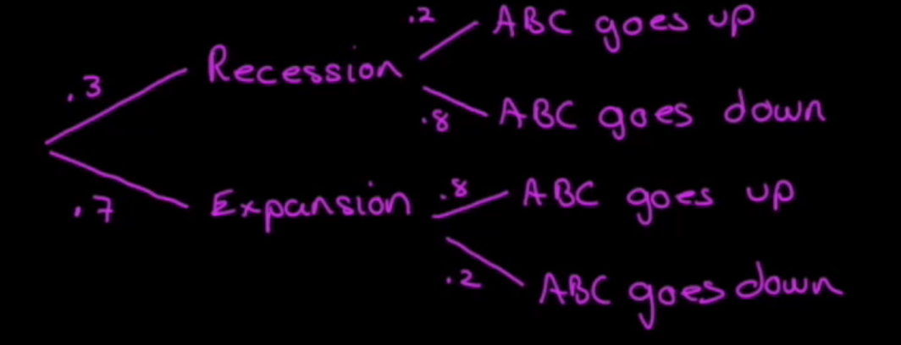
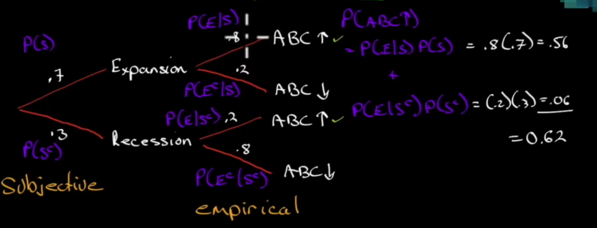

# Probability Concepts

[Video link](https://www.markmeldrum.com/courses/2018-level-i/lessons/2018-quantitative-methods/topic/2018-probability-concepts/)

## Probability

> Random Variable
>
> Definition: A quantity whose outcomes (possible values) are unknown

> Event
>
> Definition: A specified set of outcomes (either a point or a range), denoted by capital letter e.g. $A$, $B$

> Probability of an event
>
> Definition: $P(A)$, such that $0 \leq P(A) \leq 1$ and $\sum^n_{i=1} P(A_i) = 1$, for any set of:
>
> - mutually exclusive events: if one happens, another can't
> - exhaustive events: covers all possible outcomes

With all these setup, we only need 2 elements:

1. Set of all distinct possible outcomes
1. The probability distribution

### Types of probability

> Empirical probability
>
> Definition: probability based on historical observations
>
> - Past is assumed to be representative of the future
> - Historical period must include occurrences of the event
>   - If no event happens in the past, then the probability of that happens must be $0$
>

> Subjective probability
>
> Definition: Adjust an **empirical probability** based on intuition or experience. When to use?
>
> - When there is a complete lack of empirical observations
> - Make a personal assessment
>
> Note: People's subjective probability tends to OVERWEIGHT events, which means OVERWEIGHT probability of that events happening.

> A priori probability
>
> Definition: Probability at based on deductive reasoning, with no subjective whatsoever.

## Odds

Expression of probability, but NOT probability

> Odds for E
>
> Definition: Odds for E is $$Odds_{for}(E) = \frac{P(E)}{1-P(E)}$$

Ex: $P(E) = 10\%$. Then the odds for E is $\frac{.1}{.9}$ or **1 to 9** (a to b). What does 1 to 9 mean?

- For each occurence of event E, we should expect **9 events of non-occurence**.
- NOTE: this is NOT **1 in 9**. 1 in 9 implies in **9 events, there is 1 event E occurring**.

Ex: Find $P(E)$ given odds of 1 to 9.

$$P(E) = \frac{1}{1+9} = 0.1 = 10\%$$

> Odds against E
>
> Definition: $$Odds_{against}(E) = \frac{1-P(E)}{P(E)}$$

Ex: Use example above, odds against E is $\frac{.9}{.1}$ is **9 to 1**.

- This means for every 9 non-occurences of $E$, we should expect 1 occurence of $E$.

Ex: EPS estimate: $3.98-4.25

$P(EPS > 4.25)$: there are two analyst opinions

- Odds of 1 to 7 **for** $P(E) = \frac{1}{1+7} = \frac{1}{8} = .125$
- Odds of 15 to 1 **against** $P(E) = \frac{1}{15+1} = \frac{1}{16}$

## Conditional Probability

### Unconditional

> Unconditional probability
>
> Definition: $P(E)$ - what is the probability of an event $E$ happening as is.

Ex: $E$ is event of an investment manager has a portfolio return more than risk free rate $r_p > r_f$. Then:

$$P(E) = \frac{Numerator}{Denominator}$$

- Numerator: no. of observations of $r_p > r_f$
- Denominator: no. of observations of $r_p$ (this is our probability space)

### Conditional

> Conditional probability
>
> Defintion: $P(E | B)$ - what is the probability of an event $E$ happening given $B$ happens.

Ex: Same example as above, but given that $r_p > 0\%$. Then:

$P(E | B)$

- Numerator: # of obs of $r_p > r_f$
- Denominator: # of obs of $r_p > 0$ (this is our probability space)

When we look at a probability, we should try to determine what kind of conditions the possible events can happen. This gives us more confidence in the probability more than the unconditional probability

> Formal statement of conditional probability:
>
> Definition: First requires "joint probability": $P(A \wedge B)$. Then, for $P(B) \neq 0$: $$P(A|B) = \frac{P(AB)}{P(B)}$$
> 

Rearranging the above formula and using the multiplication rules, we have

$$P(AB) = P(A|B) P(B)$$
$$P(BA) = P(B|A) P(A)$$

Then

$$P(AB) = P(BA)$$
$$P(A|B)P(B) = P(B|A)P(A)$$

For the $A$ OR $B$ case:

$$P(A\vee B) = P(A) + P(B) - P(AB)$$

Ex:

-- | Period 2 win ($C$) | Period 2 loss ($D$)
-- | -- | --
Period 1 win ($A$) | $52.7\%$ (1) | $47.3\%$ (3)
Period 1 loss ($B$) | $47.3\%$ (2) | $52.7\%$ (4)

Then we have the following event:

- (1): $P(C|A)$
- (2): $P(C|B)$
- (3): $P(D|A)$
- (4): $P(D|B)$

Question: Calculate $P(BD)$

$$P(BD) = P(D|B) P(B) = 52.7\% \cdot 50\% = 26.4\%$$

Ex: $P(A) = .35$ and $P(B) = .25$, where $A$ is limit order filled at 10, and $B$ is limit order filled at 9.75

$$P(A \vee B) = P(A) + P(B) - P(AB) = .35 + .25 - P(AB) (*)$$

How do we get $P(AB)$?

- Notice that logically, if $A$ happens then $B$ won't, but if $B$ happens, then $A$ definitely will! So $P(AB) = P(B)$

Then $P(A \vee B) = (*) = .25$

How do we get $P(B|A)$?

$$P(B|A) = \frac{P(BA)}{P(A)} = \frac{.25}{.35} = .714$$

### Independence

> Independence
>
> Definition: Occurence of one event says nothing about the occurence of another
>

Ex: A coin toss. If you get heads the first toss, doesn't tell me anything about the second toss => Independent event. So we have:

$$P(A|B) = P(A)$$

so

$$P(AB) = P(A)P(B)$$

Continue at 40:10

Ex: We have two events:

- A: $EPS_{t+1} > EPS_t$ and $P(A) = .55$ based on historical observation
- B: $EPS_{t+1} < EPS_t$ and $P(B) = .45$ based on historical observation

These are called empirical probabilities because they are independent events

Calculate

$$P(EPS_{Q3} > EPS_{Q2} | EPS_{Q2} > EPS_{Q1})$$

$$= P(EPS_{t+1} > EPS_{t}) = .55$$

since the two events are independent.

Calculate

$$P(EPS_{t+2} < EPS_{t+1} \wedge EPS_{t+1} < EPS_t)$$

$$= P(EPS_{t+2} < EPS_{t+1}) \cdot P(EPS_{t+1} < EPS_t) = .45 \times .45 = .2025$$

since the two events are independent.

## Total Probability Rule

Let's say we have a scenario:

We have:

$$P(A) = P(ABC_{up} \wedge Expansion) + P(ABC_{up} \wedge Recession) (*)$$

Let:

- A: the probability of $ABC$ going up ($ABC_{up}$)
- S: the probability of an expansion ($Expansion$)
- S^c: the probability of a recession ($Recession$), the compliment of $S$

It must be true that

$$P(S) + P(S^c) = 1$$

Then:

$$(*) = P(AS) + P(AS^c) = P(A|S)P(S) + P(A|S^c) P(S^c)$$

Now, note that the probability we get for $ABC$ going up or down is empirical, but the probability of an $Expansion$ or $Recession$ is subjective.

> Total Probability Rule
>
> Definition: Probability of $A$ is the total probability of $A$ given all scenarios $S_1, S_2\cdots S_n$ for a finite $n$
>
> $$P(A) = P(A|S_1)P(S_1) + P(A|S_2)P(S_2) + \cdots P(A|S_n)P(S_n)$$
>
> In the case that $A$ is independent from $S_i$, then:
>
> $$P(A) = P(A)P(S_1) + P(A)P(S_2) + \cdots P(A)P(S_n)$$
> $$= P(A) [P(S_1) + P(S_2) + \cdots P(S_n)]$$
> $$= P(A)$$

## Expected Value

> Expected Value
>
> Definition: For $\sum^n_{i=1} P(X_i) = 1$,
>
> $$E(X) = P(X_1)X_1 + P(X_2)X_2 + \cdots + P(X_n)X_n$$
> $$ = \sum^n_{i=1} P(X_i)X_i$$

Ex: EPS forecast

EPS | P(x)
-- | --
2.60 | .15
2.45 | .45
2.20 | .24
2.00 | .16

Then

$$E(X) = .15(2.6) + .45(2.45) + .24(2.2) + .15(2) = 2.3405$$

### Variability of distribution of probability

We can use Variance:

$$\sigma^2(X) = E\left\{[X-E(X)]^2\right\}$$

Let $X_i = [X-E(X)]^2$, then

$$\sigma^2(X) = E(X_i) = \sum^n_{i=1} P(x_i)X_i$$

## Conditional Expected Value

> Conditional Expected Value
> 
> Definition: 
>
>   $$E(X|S) = P(X_1|S)X_1 + P(X_2|S)X_2 + \cdots + P(X_n|S)X_n$$
>
> Then:
>
>   $$ E(X) = E(X|S) P(S) + E(X|S^c) P(S^c) $$

Ex: Let's say we have the following

Let $A$, $B$, $C$, $D$ be the respective case of these happening:

- $P(A) = P(A|S)P(S) = .25 \cdot .60 = .15$
- $P(B) = .75 \cdot .60 = .45$
- $P(C) = .6 \cdot .4 = .24$
- $P(D) = .4 \cdot .4 = .16$

Then:

$$E(EPS|S) = .25 (2.60) + .75(2.45) = 2.4875$$
$$E(EPS|S^c) = .6(2.20) + .4(2) = 2.12$$

Then:

$$E(EPS) = .6(2.4875) + .4(2.12) = 2.3405$$

Ex: We have an event $X$, where a bond defaults. We have that $P(X) = 0.06$. The current risk free rate is $R_f = 5.8\%$. Let default risk premium be $R-R_f$. We know that if the bond defaults, the expected value $E(bond |X) = \$0$.

Question: What is the minimum risk premium (spread above $R_f$) required?

First we find the expected value of a bond.

$$E(bond) = E(TBill)$$
$$.06 (0) + .94 (1+R) = 1.058$$
$$.94 + .94 R = 1.058$$
$$.94R = .118$$
$$R = .118/.94 = .1255$$

Then $R = 12.55\%$. Then the default risk premium I am willing to take is:
$$R - R_F = 12.55 - 5.8 = 6.75\%$$

or 675 bp.

## Portfolio $E(R_p)$ and $\sigma^2$

Ex:
Asset Class | Weights | $E(R)$
-- | -- | --
S&P500 | .50 | 13%
Corp Bonds | .25 | 6%
EAFE | .25 | 15%

> Portfolio weighted returns
>
> Definition: $E(R_P)$ is weighted-average of the expected returns on different securities.
>   $$E(R_P) = w_1 E(R_1) + w_2E(R_2) + \cdots + w_n E(R_n)$$

For the example above:

$$E(R_P) = .5(.13) + .25(.06) + .25(.15) = 11.75\%$$

Portfolio variance is a bit more complicated: not only we have to consider variance on each asset, we also have to consider the combination of different assets can result in more or less variances.

Each assets will have their own variances, but a combination of assets will have their OWN variance. How do we capture this?

  - We use something called a **covariance**

### Covariance

Recall the variance of a random variable is the probability-weighted average of squared deivations. We can use this to calculate our Covariance between two random variables.

> Covariance
>
> Definition:
>   $$Cov(R_iR_j) = E[(R_i-E[R_j])(R_j - E[R_J])]$$

Once we have this Covariance, we are ready to calculate the variance of a portfolio.

> Portfolio variance
>
> Definition: Let a portfolio contain a collection of random variables $R_i$, then its variance would be
>$$\sigma^2(R_p) = \sum^n_{i=1}\sum^n_{j=1} w_iw_jCov(R_i)(R_j)$$

Note: If we see our variance of our portfolio too high, which usually means risky, we can add a combination of assets that have NEGATIVE covariance, to bring down our variance, and thus risks.

Ex: 
Var | $X_1$ | $X_2$ | $X_3$
-- | -- | -- | --
$X_1$ | $Var$ | $Cov_{13}$ | $Cov_{13}$
$X_1$ | $Cov_{21}$ | $Var$ | $Cov_{23}$
$X_1$ | $Cov_{31}$ | $Cov_{32}$ | $Var$

- If $Cov_{ij} < 0$, we have an inverse relationship
- If $Cov_{ij} > 0$, we have a positive relationship
- If $Cov_{ij} = 0$, we have no relationship

With 3 assets, we have $3\times 3 = 9$ entries: 3 Var, 6/2 = 3 Cov, that we have to calculate

> How many Vars and Covs we have to calculate for a portfolio with n assets?
>
> With n assets, we have $n\times n = n^2$ entries: $n$ Var, $\frac{n^2-n}{2}$ Cov to calculate

Ex:
Asset Class | Weights | $E(R)$
-- | -- | --
S&P500 | .50 | 13%
Corp Bonds | .25 | 6%
EAFE | .25 | 15%

Variance matrix:

A1 | A2 | A3 
-- | -- | --
400 | 45 | 189
45 | 81 | 38
189 | 38 | 441

Then our portfolio variance is:

$$\sigma^2(R_p) = (.5)^2 400 + (.25)^2 81 + (.25)^2 441$$
$$ + 2(.5)(.25)45 + 2(.5)(.25)189$$
$$ + 2(.25)(.25) 38$$

$$ = 100 + 5.0625 + 27.5624$$
$$ + 11.25 + 47.25 + 4.75$$
$$= 195.875$$

Note that the our Covariance is POSITIVE, which means the combination of these assets ADD risks.

> Tips:
>
> Diversification benefits would increase with decreasing Cov.

Statistically, our goal for diversification would be to find assets to add to our portfolio that would make one of the Cov NEGATIVE.

Continue at 2:01:40

## Correlation

0 correlation means no correlation.

> Correlation
> 

> Definition: Correlation sizes the Covariance and the variance to be between -1 and 1, with 0 being no relationship.
> $$P(R_i R_j) = \frac{Cov(R_iR_j)}{\sigma(R_i)\sigma(R_j)}$$
>
> - Correlation 1 means it's perfectly positive linear relationship
>   - When you're bullish on a sector, you might buy an oil company and a oil ETF at the same time
> - Correlation -1 means it's perfectly negative linear relationship
>   - For example, when you want to hedge your portfolio

We have:

$$P(R_1R_1) = \frac{400}{20\cdot 20} = 1$$

$$P(R_1R_2) = \frac{45}{20\cdot 9} = \frac{45}{180} = .25$$

$$P(R_1R_3) = \frac{189}{20\cdot 21} = .45$$

$$P(R_2R_3) = \frac{38}{9\cdot 21} = .20$$

Ex:

Fund | A | B
-- | -- | --
A | 625 | 120
B | 120 | 196

We have $E(R_A) = 20\%$ and $E(R_B) = 12\%$ and $W_A = .75$ and $W_B = .25$

1. Calculate $E(R_p)$

$$E(R_p) = .75(.20) + .25(.12) = .15 + .03 = .18 = 18\%$$

2. Calculate correlation matrices

- | A |B
-- | -- | --
A | 1 | $\frac{120}{25\cdot 14} = .343$
B | - | 1

3. Compute $\sigma(R_p)$

$$\sigma^2(R_p) = (.75)^2 (625) + (.25)^2(196) + 2(.75)(.25)(120) = 351.5625 + 12.25 + 45 = 408.8125$$

Then:
$$\sigma(R_p) = \sqrt{408.8125} = 20.22\%$$

## Joint Probability Function

$P(X, Y)$ not to be confused with $P(X|Y)$

- joint: the probability of $X$ happening along with $Y$
- conditional: $P(X)$ given that $Y$ has already happened

Ex:

-- | $R_B = 20\%$ | $R_B = 16\%$ | $R_B = 10\%$ | Economy
-- | -- | -- | -- | -- 
$R_A = 25\%$ | $.20$ | $0$ | $0$ | good
$R_A = 12\%$ | $0$ | $.50$ | $0$ | fair
$R_A = 10\%$ | $0$ | $0$ | $.3$  | poor

Then:

$$E(R_A) = .25(.20) + .12(.50) + .1(.3) = 14\%$$
$$E(R_B) = .20(.20) + (.16)(.50) + .1(.3) = 15\%$$

What if:

-- | $R_B = 20\%$ | $R_B = 16\%$ | $R_B = 10\%$ | Economy
-- | -- | -- | -- | -- 
$R_A = 25\%$ | $.20$ | $.05$ | $.05$ | good
$R_A = 12\%$ | $0$ | $.45$ | $0$ | fair
$R_A = 10\%$ | $0$ | $0$ | $.25$  | poor

Then:
$$E(R_A) = .25(.3) + .12(.45) + .1(.25) = 15.4\%$$
$$E(R_B) = .20(.20) + .16(.50) + 1(.30) = 15\%$$

Simply, just sum up the row for $A$ and column for $B$ to get the probability for the expected returns.

### Covariance

- | $R_A - E(R_B)$ | $R_B - E(R_B)$ | cross product | $P(R_AR_B)$ | $P(R_A, R_B) [R_{A_i}-E(R_A) \times R_{B_i} E(R_B)]$
-- | -- | -- | -- | -- | --
Good | (25 - 14) = 11 | (20 - 15) = 5 | 55 | .2 | 11
Fair | (12 - 14) = -2 | (16 - 15) = 1 | -2 | .5 | -1
Poor | (10 - 14) = -4 | (10 - 15) = -5 | 20 | .3 | 6/16

We have that: $E(R_A) = 14\%$ and $E(R_B) = 15\%$

Then: $$Cov(R_A R_B) = \sum^n_{i=1} \sum^n_{j=1} P(R_AR_B) (R_{A_i} - RE_A)(R_{B_j} - ER_B)$$

Since $Cov(R_AR_B) > 0$ means when $R_A > E(R_A)$ than $R_B > E(R_B)$ => this means they covary positively.

## Bayes Formula

$P(S)$ and $P(S^c)$ is prior probability, because it's happening before the fact.

Q: What is the probability of being in an expansion given that $ABC$ goes up? Bayes Formula said:

$$P(S|E) = \frac{P(E|S)}{P(E)} \cdot P(S) = \frac{.8}{.62} \cdot .7 = .90$$

Q: What is the probability of being in an recession given that $ABC$ goes up? Bayes Formula said:

$$P(S|R) = \frac{P(R|S)}{P(R)} \cdot P(S)$$

These are called posterior probability, because this is happening after the fact.

## Principles of Counting

### Multiplication Rule

4 shirts, 5 ties, 3 jackets, 4 pants, how many outfits can you make?

$$4 \times 5 \times 3 \times 4 = 240$$

### Multinomials

15 students split into 3 groups. Group 1 (6), Group 2 (4), Group 3 (6): order does not matter.

## Combinations

> Combinations
>
> Definition: Number of ways to select $r$ objects from a group of $n$
> $$nCr = (n, r) = \frac{n!}{(n-r)! r!}$$

Ex: Choose 3 companies out of a pool of 7 to analyze:

$$(7,3) = \frac{7!}{4!3!} = 35$$

# Permutations

Order matters!

> Permutations
>
> Definition: $$nPr = \frac{n!}{(n-r)!}$$

Ex: Choose 3 companies, ranked 1 2 3, from 7 (order now matters), then:

$$(7,4) = \frac{7!}{4!} = 210$$
