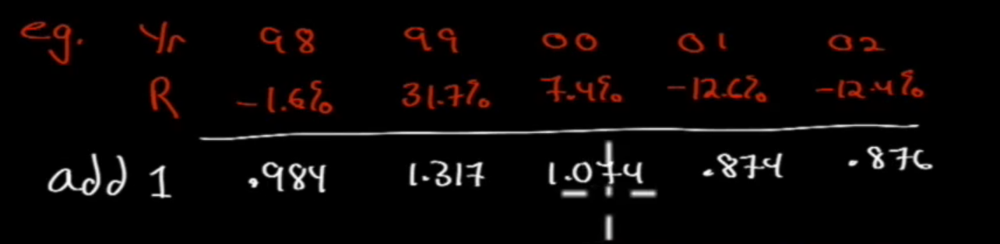

# Statistical Concepts

We want to find a way to describe data. We're not asking questions - we want to understand the data

## Population (Sample) Data

We can have: H/L, mean, median, mode -> description

If we have sample data, and we make forecasts to the domain where we don't have population data, that's called "forecasting" and "inferring". This is called inferential.

> Definition: **Population** includes all members of a specified group
>-> all descriptive measures are called "Parameters".

For example, if we get information from the Population like H/C, mean, median, mode, they are called "Parameters"

> Definition: **Sample** is a subset of a population
> -> all descriptive measures are called "Sample Statistics".

For example, again if we get information like H/C, mean, median mode, they are called "Sample Statistics".

If we take a sample, is it representative of the population?

## Measurement Scales (NOIR)

> Nominal scale
>
> Definition: weakest level of measurement, categorical
>
> Example: 1) large cap stocks, 2) mid cap, 3) small cap, 4) micro cap

Not much useful information you can extract from this. Maybe observations, census, not a lot you can do here

> Ordinal scale
>
> Definition: Ranking. Howere, does not say anything about the distance between different ranks
>

Magnitude is not factored in ordinal scale, so not very much useful also

> Interval scale
>
> Definition: Something like Liker scale temperature, assumes equal distance (physical, psychometric) between intervals.

Pretty useful, but still have to ask more questions.

> Ratio
> 
> Definition: Strongest level of measurement. Interval + true zero point i.e. money, dinero, doolars...

## Frequency Distributions

> Frequency Distributions
>
> Definition: A tabular diplay of data grouped into intervals, this works with all measurement scales.

Methodology to build frequency distribution:

1. Sort data in ascending order
1. Calculate the range ($max$-$min$)
1. Choose a number of intervals ($k$)
1. Determine the interval width ($\frac{max-min}{k}$)

Ex: We choose $max=42$ and $min=18$, and our intervals $k=4$, then our interval width is $(42-18)/6 = 4$4

### Intervals

How do we pick them?

- Too few: too much aggregation, not enough detail
- Too many: too much detail, not enough aggregation
- What intervals should be depend on:

  - Type of data
  - No of observations
  - Nature of analysis
  - Experience
    - Read literature to see what other people have done this

Ex: 

### Graphic Presentation

Sometimes data is pretty hard to see, maybe a little picture could be more of value to us.

#### Histogram

> Histogram
>
> Definition: A bar chart of frequency distribution

Ex: Let's take the data from the example we have in the above section.

Make sure to leave no gaps between your different categories if there are no gaps between the categories; if you do, it often means no observations in that category.

#### Frequency Polygon

Histogram, but lines and points instead of rectangles. Smoother look of what the distribution is like.

#### Cumulative Frequency Distribution

The line has to be ever increasing.

Slope at any interval is proportional to number of observations in that interval.

Continue at 28:30

## Measures of Central Tendency

We would like to explore what does the data MEAN, what it's SAYING, other than what it APPEARS to be.

> Quantitative (measures of location)
>
> Definition: Measures of central tendency => specifies whether the data are centered

### Arithmetic Mean

> Population mean
>
> Definition: mean of a population (which is a **parameter**), defined by
> 
> $$\mu = \frac{\sum^N_{i=1} x_i}{N}$$

Using $\mu$, this means a mean of a POPULATION, no question.

> Sample mean
>
> Definition: mean of a sample (which is a **sample mean**), defined by
>
> $$\bar{x} = \frac{\sum^n_{i=1} x_i}{n}$$

Note the change in notation, the sample mean is $\bar{x}$. Remember that you have to keep notation consistent.

Ex: Let's say you have a college class of Aug, Fall 2016. This is a POPULATION. This population contains N sections. The average of this population is

$$\mu = \frac{\sum^{N}_{i=1} x_i}{N}$$

This is called a **cross-sectional mean**. A use for this is comparing Professor/section, by comparing each section to the cross-sectional mean of the population.

We have a time series data for section 1 from 2016-2011. The mean of this data is called the **time-series mean**.

#### Misconception

The mean does not mean (pun not intended) 50% of the observation, this means deviations from the mean sum to zero.

### Median

> Median
>
> Definition: Value in the middle ("middlemost")

Now THIS does mean there are 50% above and 50% below. How to calculate it?

- If $n$ is odd, then median = $\frac{n+1}{2}$th
- If $n$ is even, then median = $\frac{n/2 + (n+1)/2}{2}$

### Mode

> Mode
>
> Definition: Most frequently occuring observation, which can include
>
> - Unimodal: 1 mode
> - Bimodal: 2 modes
> - No mode

Fun fact, if you want to catch cheaters, check bimodal mean, if there are peak very close to 100, then very likely there are cheaters.

> Mode is the only measure of central tendency that can be used with nominal (categorical) data.

### Weighted mean

> Weighted mean
>
> Definition: Different weights for different observations.
>
> $$\bar{X}_w = \sum^n_{i=1} w_i x_i$$
> where $\sum^n_{i=1} w_i = 1$.

Ex: If we have $100M, 70% in equities with 10% ROI, and 30% in bonds with 8% ROI. The weighted ROI for this is:

$$.7(.10) + .3(.08) = .07 + .024 = 9.4$$

### Geometric mean

> Geometric mean
>
> Definition: most used to average "rates of change"  (i.e. growth rate of a variable)
> $$G = \sqrt[n]{x_1 x_2 x_3 \cdots x_n}$$

To avoid $x_i < 0$, add 1 to each $x_i$ (expressed as decimal)

Ex: 

Then $G = \sqrt[5]{(.984)(1.317)(1.074)(.874)(.876)} = 1.012792 - 1 = 1.279\%$

> General Formula:
> $$1 + R_G = \sqrt[T]{(1+R_1)(1+R_2)\cdots(1+R_T)}$$
> $$1 + R_G = \left[\Pi^T_{t=1}(1+R_t)\right]^{1/T}$$
> Then:
> $$R_G = \left[\Pi^T_{t=1}(1+R_t)\right]^{1/T} - 1$$

### Comprehensive Example

We have two funds with the following returns:

We have $R_G$ of `SLASX`:

$$ R_G = [(1.162)(1.203)(1.093)(.889)(.83)]^{1/5} - 1 = 2.43\%$$

This means that 1 dollar invested in PRFDX in 1998 grows to $(1.0243)^5 = 1.127$ by 2002.

Note for $R_A$:

$R_A = \frac{9.2+3+13.1+1.6-1.13}{5} = 2.78%$

We have $R_G$ of `PRFDX`:

$$R_G = [(1.092)(1.03)(1.131)(1.016)(.87)]^{1/5} - 1 = 2.37\%$$

This means that 1 dollar invested in PRFDX in 1998 grows to $(1.0237)^5 = 1.244$ by 2002.

Note for $R_A$:

$R_A = 3.54\%$

> If you want to look at the growth in your money over the years, you have to take a look at your Geometric Mean

Some things to keep in mind:

> It's always $R_G \leq R_A$, where the case of $R_G = R_A$ only if all observation are equal.
> Also, $R_G < R_A$ more and more as std increases

Ex: We have at the beginning, we have $100, then at end of year 1, we have 200, coming to 100% return. At the end of year 2, we have 100, so we have -50% return from year 1 to year 2.

Let's do some comparison:

$$R_A = \frac{100-50}{2} = 25\%$$

Nuh-uh. Compared to

$$R_G = \sqrt{2}\sqrt{.5} - 1 = 0$$

Which looks more like it. Note that to get the true returns use Geometric Mean. Arithmetic can be skewed and not the big picture.

Continue at 1:01:41

### Harmonic Mean

Very limited application

> Harmonic mean
>
> Definition: Average ratios => but only when they are repeatedly applied to a fixed quantity to yield a variable # of units
>
> $$\bar{X}_H = \frac{n}{\sum^n_{i=1} (1/x_i)}$$

Ex: You put $1000 in a fund per period every 2 months. Then harmonic mean

$$\bar{X}_H = \frac{2}{1/10+1/15} = 12$$

### Quantiles

Rank data from max to min, then we have quantiles:

- 50:50 split => median
- 25:25:25:25 split => quartile
- 20:20:20:20:20 split => quintile
- 10:10:...:10 => deciles
  - Very typical in economics
- 1:1:...:1 => percentiles
  - If you're in yth percentile, (100-y)% of observation lies above you
  - E.g.: scores in an exam

Locating percentiles

$$L_y = (n+1) \frac{y}{100}$$

$y$ being the percentage point of interest. $L_y$ may not be a whole number.

If $L_y$ is not whole number, we can use linear interpolation. If $obs_12 = 20$ and $obs_13 = 30$, then

$$obs_{12.75} = 12 + 0.75 (30-20) = 27.5$$

### Dispersion

#### Range

> Range
>
> Definition: Max - min => extrteme values (called outliers) may distort the range.

#### Mean Aboslution Deviation

> Mean Absolute Deviation
>
> Definition: The mean of all the deviation of the obsevation from the mean
> $$MAO = \sum^n_{i=1} \frac{|x_i-\bar{x}}{n}$$

#### Variance and Standard Deviation

> Variance
>
> Definition: $$\sigma^2 = \frac{\sum^N_{i=1} (x_i - \mu)^2}{N}$$

The standard deviation is just the root of variance

> Standard Deviation
>
> Definition: $$\sigma = \sqrt{\sigma^2}$$

Then for Sample 

> Sample variance
>
> Definition: With $n-1$ be the minimum of independent ways a system can vary, we have $$S^2 = \frac{\sum^n_{i=1} (x_i - \bar{x})^2}{n-1}$$

Then the sample std

> Sample Standard Deviation
>
> Definition: $$S = \sqrt{S^2}$$

Since $\sum(x_i-\bar{x}) = 0$, if we know values of $n-1$ obs, we can calculate the last => the last one is not independent.

> Note: $MAD \leq S$, since $S$ gives more weight to larger deviations than smaller ones.

> $S$ measures dispersion around the arithmetic mean. For geometric mean,
>
> $$\sigma^2_g = e^{A}$$
> where
> $$A = \frac{\sum^n_{i=1}(\ln \frac{A_i}{\mu_g})^2}{N}$$

#### Semivariance

How to find this

1. Find $\bar{x}$
1. Select all $obs \leq \bar{x}$
1. $s^2 = \sum(x_i-\bar{x})/(n-1)$ for all $x_i < \bar{x}$. Use full dataset $n$, not just $obs \leq \bar{x}$!!!

#### Semideviation

How to find this: $s = \sqrt{s^2}$, simple as that.

#### Target Semivariance

> Target Semivariance
>
> Definition: For all $x_i < B$, where $B$ is target value.
> $$s^2 = \sum(x_i - B)/(n-1)$$
> 
