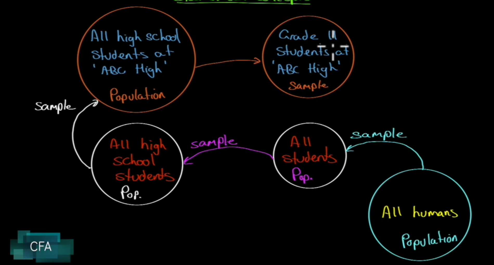
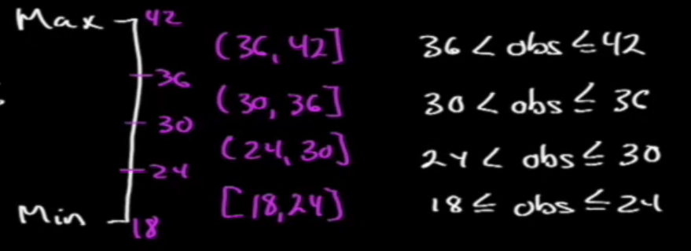
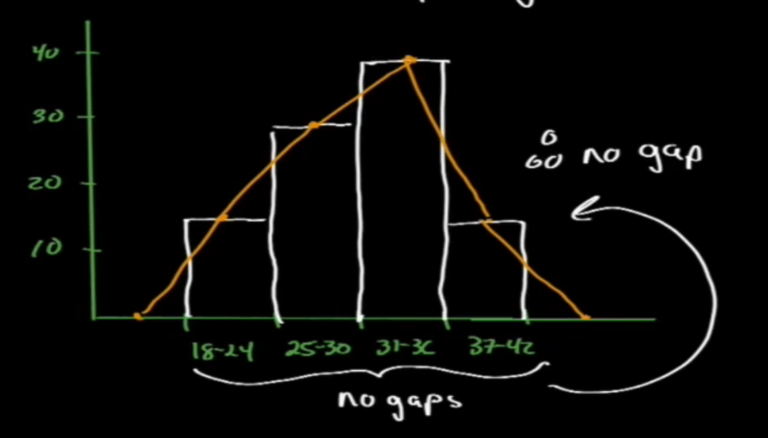
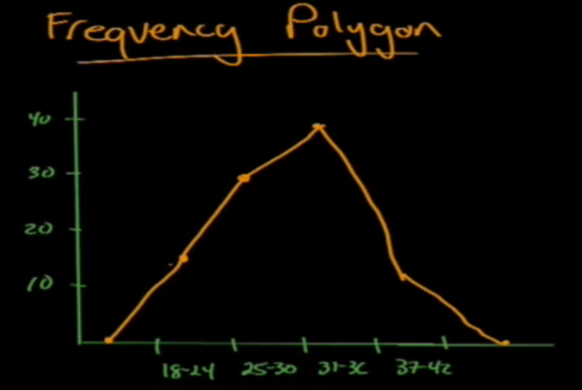
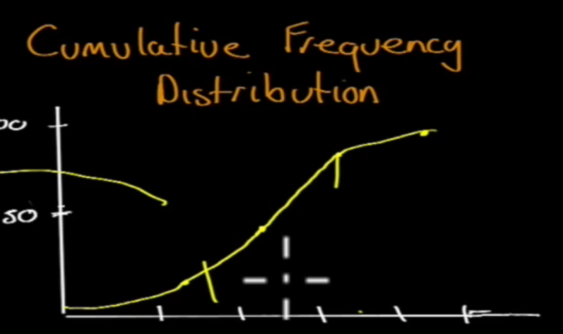

# Statistical Concepts

We want to find a way to describe data. We're not asking questions - we want to understand the data

## Population (Sample) Data

We can have: H/L, mean, median, mode -> description

If we have sample data, and we make forecasts to the domain where we don't have population data, that's called "forecasting" and "inferring". This is called inferential.

> Definition: **Population** includes all members of a specified group
>-> all descriptive measures are called "Parameters".

For example, if we get information from the Population like H/C, mean, median, mode, they are called "Parameters"

> Definition: **Sample** is a subset of a population
> -> all descriptive measures are called "Sample Statistics".

For example, again if we get information like H/C, mean, median mode, they are called "Sample Statistics".

If we take a sample, is it representative of the population?

## Measurement Scales (NOIR)

> Nominal scale
>
> Definition: weakest level of measurement, categorical
>
> Example: 1) large cap stocks, 2) mid cap, 3) small cap, 4) micro cap

Not much useful information you can extract from this. Maybe observations, census, not a lot you can do here

> Ordinal scale
>
> Definition: Ranking. Howere, does not say anything about the distance between different ranks
>

Magnitude is not factored in ordinal scale, so not very much useful also

> Interval scale
>
> Definition: Something like Liker scale temperature, assumes equal distance (physical, psychometric) between intervals.

Pretty useful, but still have to ask more questions.

> Ratio
> 
> Definition: Strongest level of measurement. Interval + true zero point i.e. money, dinero, doolars...

## Frequency Distributions

> Frequency Distributions
>
> Definition: A tabular diplay of data grouped into intervals, this works with all measurement scales.

Methodology to build frequency distribution:

1. Sort data in ascending order
1. Calculate the range ($max$-$min$)
1. Choose a number of intervals ($k$)
1. Determine the interval width ($\frac{max-min}{k}$)

Ex: We choose $max=42$ and $min=18$, and our intervals $k=4$, then our interval width is $(42-18)/6 = 4$4

### Intervals

How do we pick them?

- Too few: too much aggregation, not enough detail
- Too many: too much detail, not enough aggregation
- What intervals should be depend on:

  - Type of data
  - No of observations
  - Nature of analysis
  - Experience
    - Read literature to see what other people have done this

Ex: 

### Graphic Presentation

Sometimes data is pretty hard to see, maybe a little picture could be more of value to us.

#### Histogram

> Histogram
>
> Definition: A bar chart of frequency distribution

Ex: Let's take the data from the example we have in the above section.

Make sure to leave no gaps between your different categories if there are no gaps between the categories; if you do, it often means no observations in that category.

#### Frequency Polygon

Histogram, but lines and points instead of rectangles. Smoother look of what the distribution is like.

#### Cumulative Frequency Distribution

The line has to be ever increasing.

Slope at any interval is proportional to number of observations in that interval.
