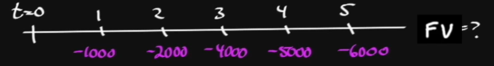

# Interest rates

- Required rate of return: corporate finance  
- Discount rate: fixed income and equity evaluation  
- Opportunity cost: economics/corporate finance  
  - Choosing one project vs another  
- All points to interest rates here

Scenario:

- If we are offered to lend 1000 dollars and will receive 1500 in 2 years, and we want 10% to be interested, then would we take up this offer

Suppose I lend you $1000 for one year, I will want:  
R\_f

- Real risk-free rate for one year  
  - Rate I would get on very safe 1Y treasury  
  - But I would want more since price change  
+  inflation premium  
  - Preserve my purchasing power  
  - I want at least expected inflation for my money I lend you

- **These two combined make something called *nominal risk-free* rate**  
  - \[(1+r\_f)(1+inf)\] \- 1  
  - I don’t have to calculate this myself, I can take a look at the 1Y treasury market  
  - Market is reflecting these two components, and we can use this as-is  
  - Nominal risk-free rate basically means the bare minimum interest you can get *for a risk free investment*

+ default risk premium  
- I’m lending moolah to YOU, not the government  
- You might not pay me off at all  
- You ain’t risk-free, so I would want something extra for that  
- Varies by investment, credit, trust, bla bla  
- Depends on your risk profile

+ Liquidity premium  
- How easy can I exit?  
- How liquid is it?  
- I would also want extra buckies for taking on this risk too  
- I can buy marketable debts instead, why the hell would I buy from you?

+ Maturity premium  
- Higher my money is in the oven, the riskier it gets  
- This is higher the longer the investment period

- **These remaining threes: spread**  
  - Base \+ spread makes up the interest rate  
  - Specific to the borrower

Interest rates can change by a lot of things

- Inflation fluctuates  
- The borrower aint paying or the   
- More difficulty passing the bags  
- Can change a lot of reasons not only because of central banks

# Future Value

- P\_v: present value  
- F\_v: future value  
- R: interest rate  
- N: \# of compounding periods

- FV \= PV(1+r)^N: compounding  
- PV \= FV/(1+r)^N

- R & N must be compatible wrt t  
- Example: $100 for 5 years @ 6%  
  - Semi-annual  
  - Quarterly  
  - Etc….

Let’s do some exercise:

- $5M to invest @ 7% \=\> 5-yr annual CD  
- FV \= PV(1+r)^N \= 5M(1.07)^5 \= 7,012,58.65  
- PV should always be in negative form  
  - PV \= \-5M  
  - PMT \= 0  
  - Interest rate \= 7  
  - N \= 5  
  - Compute FV

- What if we have semi annual, then we can do:
    $$FV = 5M(1 + (0.07/2))^{10} = 5M(+$$

## Another example of Future Value
```
2.5M yen @ 8% for 6-years
```
$$FV = PV(1+r)^N = 2.5M(1.08)^6 = 3,967,186$$

This is pretty easy, let's do something more fun
```
$10M @ t_5, invested @9%. Find FV @ t_15 as of t_0.
```
We can just simply calculate for as long as the money is invested:
$$ FV = 10M(1.09)^{10} \approx 23.7M$$

Let's see if we are right. First find PV at $t_0$:
$$PV = \frac{FV}{(1+r)^N} = \frac{10M}{(1.09)^5} \approx 7M$$

then check:
$$FV = 7M (1.09)^{15} \approx 23.7M$$

basically the same, so we can just calculate as is at the start of $t_5$

## Compounding frequency

Stated annual interest rate $r_s$ (quoted interest rate)
$$ FV = PV(1+\frac{r_s}{m})^{mN}$$

Example:
```
2-yr CD @ 8% quarterly
```
We have:
$$10,000(1+.08/4)^{4\cdot 2} = 11,716.59$$

These will be very important when we comes to the quantitative section.

## Continuous compounding
Very common with derivatives, especially for futures and forwards. You have to use this because that's what the market uses.

```
$100 @ 5%
```

| Compounding Frequency| FV | Effective Annual Rate (EAR)|
|---|---|---|
| annually | $105 | 5% |
| semi-annual | $105.06 | 5.06% |
| quarterly | $105.09 | 5.09% |
| monthly | $105.12 | 5.12% |
| daily | $105.13 | 5.13% |
| **continuous** | $100e^{r_sN}$ = 105.13|  5.13%

Tips: continuous compounding yield very close to daily compounding

### EAR
How to calculate?
> $$EAR = (1+\frac{r_s}{m})^m - 1$$

For continuous compounding, a little different:
> $$ EAR = e^{r_s} - 1$$

if we know EAR, we can solve for $r_s$.

Continue at 41:31

## Annuity
Definition: Finite set of level (i.e. equal) sequential cash flows
- Ordinary - first cash flow at $t_i$
- due - first class flow at $t_0$

Perpetuity - infinite ordinary activity
e.g. Ordinary annuity


Sum those up together, we have $5525.63$. This is too long, we have a better equation, called FV annuity factor

> $$FV = A\left[\frac{(1+r)^N - 1}{R}\right]$$

Plugging the above value in, we have
$$100 \left[\frac{(1.05)^5-1}{0.05}\right] = \$5525.63$$

which is exactly equal to what we have above.

Future value of an Ordinary Annuity -> Annuity Due:

> $$FV = A\left[\frac{(1+r)^N - 1}{R}\right] \times (1+r)$$

## Unequal Cash Flows


What happen when payment due at each $t$ is different. We can do it the caveman way of

$$1000\cdot (1.05)^4 + 2000\cdot(1.05)^3 + \cdots + 6000 (1.05)^0 = 19,190.76$$

### Present Value

> $$PV = FV(1+r)^{-N} \text{(if dealing with different time ranges)}= FV (1+r_s/m)^{-mN}$$

Ex: Find PV if disc. rate = 8%, where FV = 100k
$$PV = 100k(1.08)^{-6} = 63,016.96$$

Ex: What is the value 4 years from now if $r=8\%$, where FV at $t=10% is 100,000?
We only have to care about the timespan between that timepoint to the timepoint of the FV, so:
$$PV_{t_4}=100k(1.08)^{-6} = 63,016.96 = 100k(1.08)^{-10}(1.08)^{4}$$

### Frequency & PV

Ex: FV = $5M @ $t_{10}$, $r=6\%$, compounded monthly
$$PV = frac{5M}{(1+0.06/12)^{12\times 10}} = 2,748,163.67$$

## Present Value of a Series of Cash Flow

> An annuity (series of equal payments made at regular intervals) has four characteristics:
>
> 1. Finite set of payments
> 1. Level cash flow
> 1. Sequential cash flow
> 1. $t_1 = CF_1$

We have
> $$PV = A \left[\frac{1-(1+r)^{-N}}{r}\right]$$

For an Annuity Due, first payment at $t=0$, so we don't have to discount the first payment

Ex: We are offered two payment option:

1. 2M @ $t=0$
1. $200k/yr, $t_0 - t_{19}$ (i.e. 20 payments) with $r=7\%$

The second option is an *annuity due*, because the first payment is at $t=0$. What is the PV of the second option?
$$PV = 200k \left[\frac{1-(1.07)^{-19}}{.07}\right] + 200k = 2,267,119.05$$

Ex: We are an investment manager, we have to pay 1M each year for 30 years, beginning on $t=10$. Find PV for $r=5\%$.

We can start with annuity due if we consider our start is at $t=10$, but it is easier if we convert this into an Ordinary Annuity, if we consider our start at $t=9$. So at this $t=9$, we have an ordinary 30-year annuity and

$$PV_9 = 1M\left[\frac{1-1.05^{-30}}{.05}\right] = 15,372,451.03.$$
Then we have

$$PV = PV_0 = \frac{PV_9}{(1.05)^9} = 9,908,219.$$

## Perpetuity

> A perpetuity has 3 properties:
>
> 1. Level CF
> 1. Sequential 
> 1. Infinity (i.e $N\to\infty$)

We have

>$$PV = \frac{A}{r}$$

Ex: Perpetuity investment $100/year at $r=5\%$. How much would you pay today?
$$PV = \frac{A}{r} = \frac{100}{.05} = \$2000$$

Ex: Perpetuity investment $100/year, but you won't receive money until $t=5$. How much would you pay for it today i.e. PV?

We first find $PV_4$, PV of a perpetuity starting at $t=4$:
$$PV_4 = \frac{100}{.05} = 2000$$

Then we find PV from this:
$$PV = \frac{PV_4}{(1.05)^4} = \frac{2000}{1.05^4} = 1,645.40$$

Continue at 1:30:26
